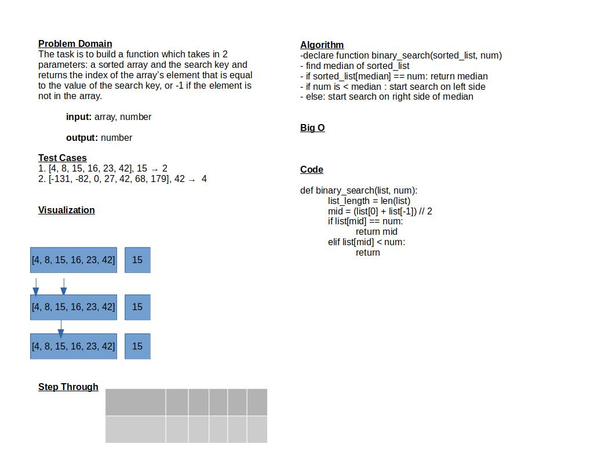

# Binary Search of Sorted Array

The purpose of this function is to take in a sorted list and a number and return an index of the number in the list using a binary search.

## Whiteboard Process

## Approach & Efficiency

I made tentatively made this function by finding the median number of the sorted list by taking the first value and the last value and dividing by 2. If the number is less than the median than I would initiate the search on the left side. If the median value is greater than the median I would initiate the search on the right side.

Time: O(logn)
Space: O(logn)
