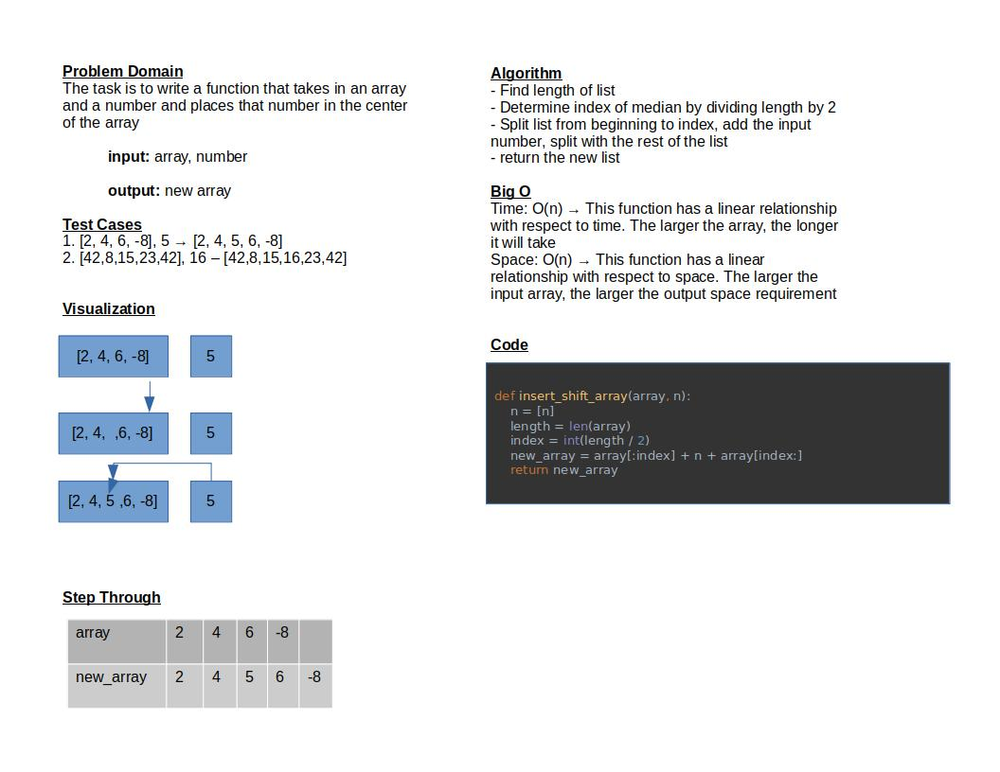

# Insert to Middle of an Array

The purpose of this function is to take in a list and a number and return a new list with that number inserted into the middle of the list

## Whiteboard Process

## Approach & Efficiency

I made this function by finding an index by dividing the length of the list by 2 and splitting the list from the beginning to the index and from the index to the end. I then added the number in between the split to add the number to the middle of the list.

This function is linear in relation to time and space efficiency (O(n)). The time and space requirement increase with respect to the size of the input array
