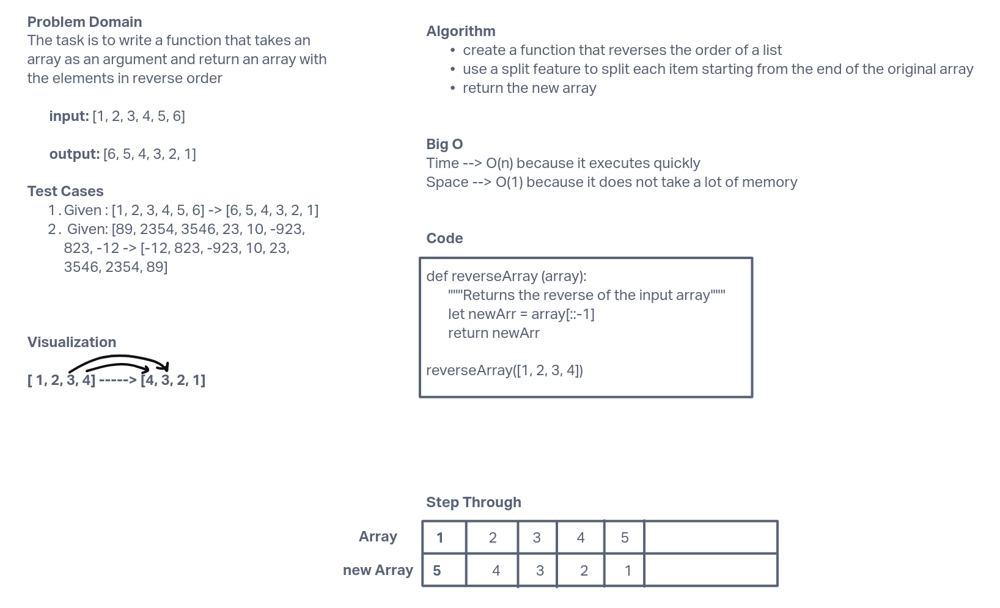

# Reverse an Array

The task for this challenge was to define a function that would take in an array and return that array in reverse order.

## Whiteboard Process

## Approach & Efficiency

I took the approach of using the split feature `[::-1]`. The main reason i used this is because we were not allowed to use built in functions otherwise I would have used `.reverse()` to do this challenge. The Big O for time is O(1) because it executes quickly. The Big O for space is O(1) because it takes up the optimal space.
