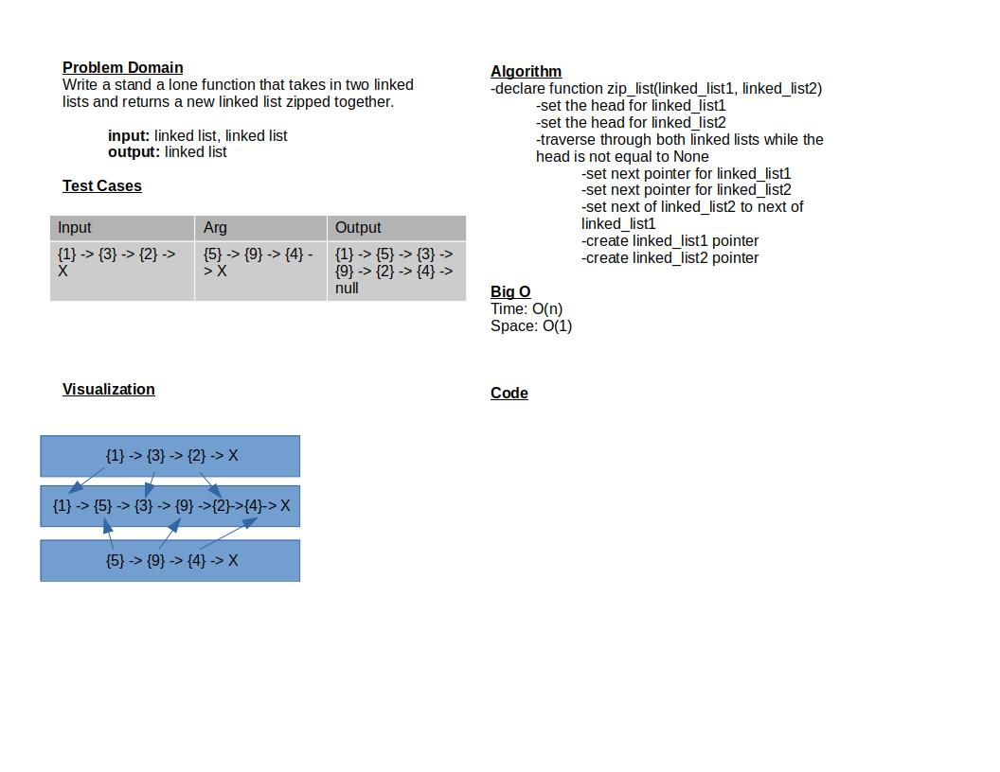

# Challenge Summary

Given two linked lists as input. The task is to return a linked list that is the result of merging both linked lists together one after the other.

## Whiteboard Process

## Approach & Efficiency

My approach is to traverse both linked lists and set their next value to the next of the other.

Time Efficiency: O(n) -> time increases with the size of the linked lists
Space Efficiency: O(1) -> The amount of space required should not increase

## Solution
