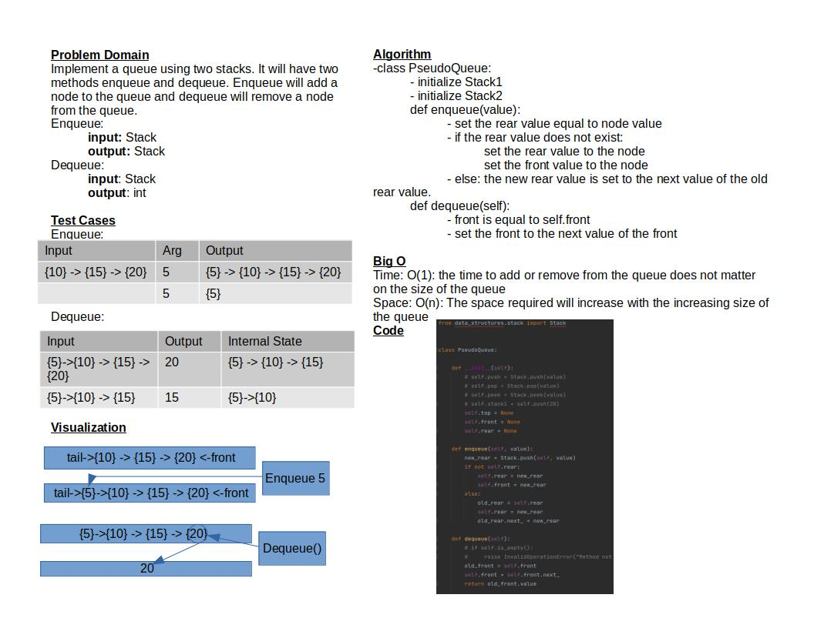

# Challenge Summary

Implement a queue using two stacks.
It will have two methods enqueue and dequeue.
Enqueue will add a node to the queue and dequeue
will remove a node from the queue.

## Whiteboard Process

## Approach & Efficiency

The approach I took was similar to the queue challenge.
Time: O(1): the time to add or remove from the queue does not matter on the size of the queue
Space: O(n): The space required will increase with the increasing size of the queue

## Solution

To run the test for stack_queue_pseudo.py run: `pytest-watch -c -- -k test_stack_queue_pseudo.py`

The code does not yet work and only passes one / four tests
