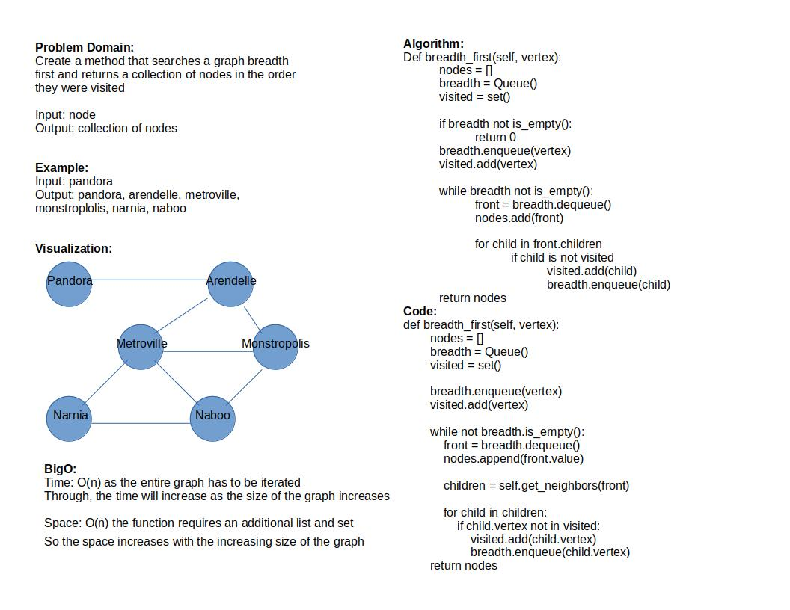

# Graphs

Create a graph module

## Challenge

Implement a Graph module that can add nodes, create edges, and retrieve the nodes from within the graph

## Approach & Efficiency

Time: O(1) since the graph is a dictionary at the base, the time efficiency requires one action

Space: O(n) as the number of nodes and edges increase so does the space requirement

## API

def add_node(self, value): this method creates a node in a graph which is an instance of the class Vertex

def size(self): This method returns the size of the dictionary keys which indicates the overall size of the graph

def get_nodes(self): This method returns all of the values corresponding to the keys in the dictionary

def add_edge(self, start_vertex, end_vertex, weight=0): Creates an instance of the Edge class and adds a weight value to the edge between two nodes

def get_neighbors(self, vertex): returns the value of nodes that correspond to a given vertex

## Breadth First

### Whiteboard

### Efficiency

Time: O(n) as the entire graph has to be iterated
Through, the time will increase as the size of the graph increases

Space: O(n) the function requires an additional list and set
So the space increases with the increasing size of the graph

[code](../../data_structures/graph.py)

[test](../../tests/code_challenges/test_graph_breadth_first.py)
