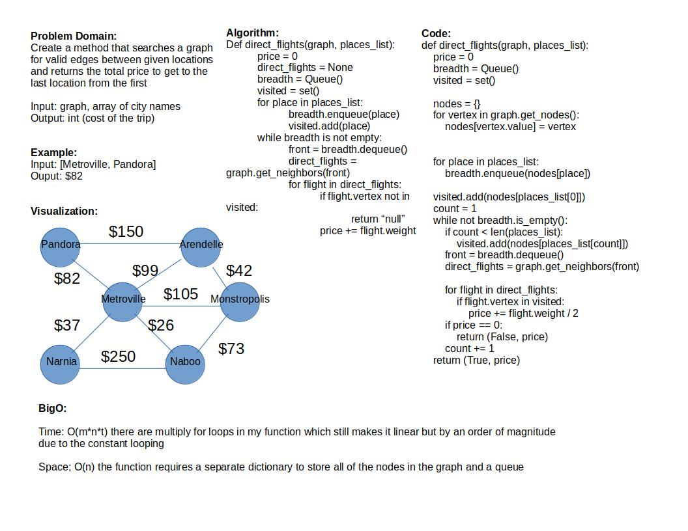

# Challenge Summary

Create a method that searches a graph for valid edges between given locations and returns the total price to get to the last location from the first

## Whiteboard Process

## Approach & Efficiency

Time: O(m*n*t) there are multiply for loops in my function which still makes it linear but by an order of magnitude
due to the constant looping

Space; O(n) the function requires a separate dictionary to store all of the nodes in the graph and a queue

## Solution

To run the test for stack_queue_pseudo.py run: `pytest-watch -c -- -k test_graph_business_trip.py`

5/5 tests pass

[Code](../../code_challenges/graph_business_trip.py)
[tests](../../tests/code_challenges/test_graph_business_trip.py)
