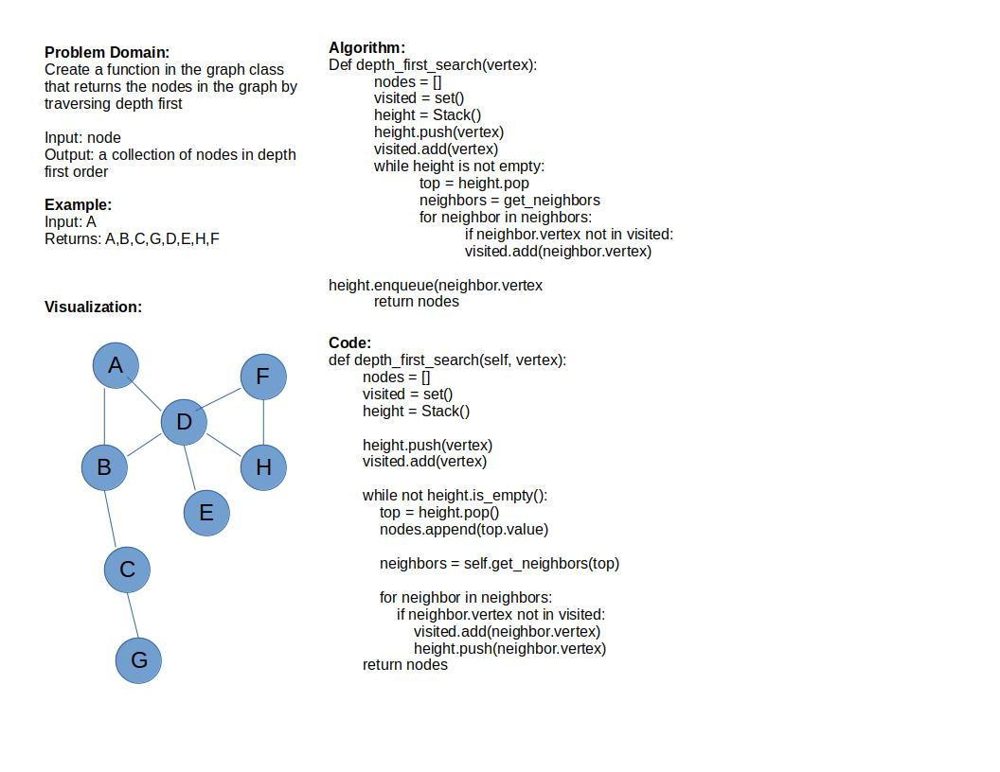

# Depth First

## Whiteboard

### Efficiency

Time: O(n) as the entire graph has to be iterated
Through, the time will increase as the size of the graph increases

Space: O(n) the function requires an additional list and set
So the space increases with the increasing size of the graph

[code](../../data_structures/graph.py)

[test](../../tests/code_challenges/test_graph_depth_first.py)
