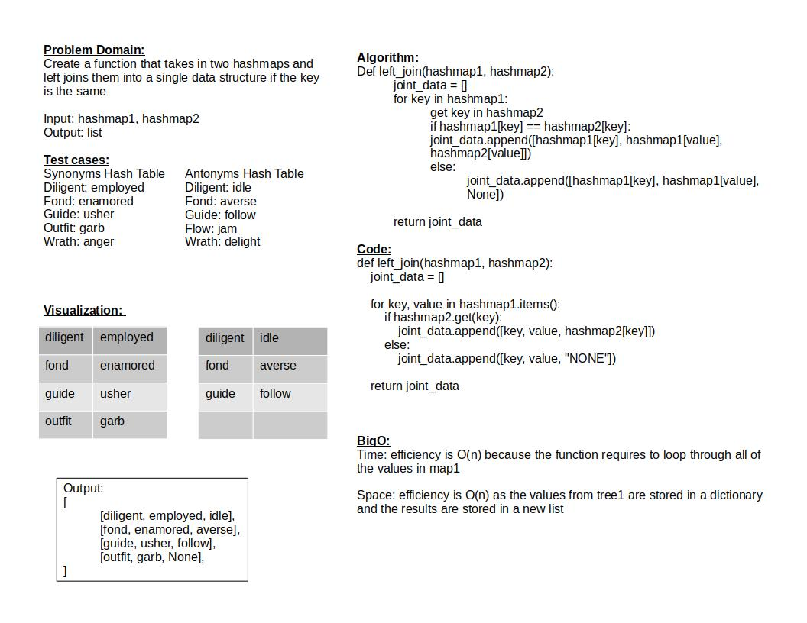

# Challenge Summary

Create a function that takes in two hashmaps and left joins them into a single data structure if the key is the same

## Whiteboard Process

## Approach & Efficiency

Time: efficiency is O(n) because the function requires to loop through all of the values in map1

Space: efficiency is O(n) as the values from tree1 are stored in a dictionary and the results are stored in a new list

## Solution

test is run by: `pytest-watch -c -- -k test_tree_intersection.py`

[Link to code](../../code_challenges/hashtable_left_join.py)

[Link to tests](../../tests/code_challenges/test_hashtable_left_join.py)
