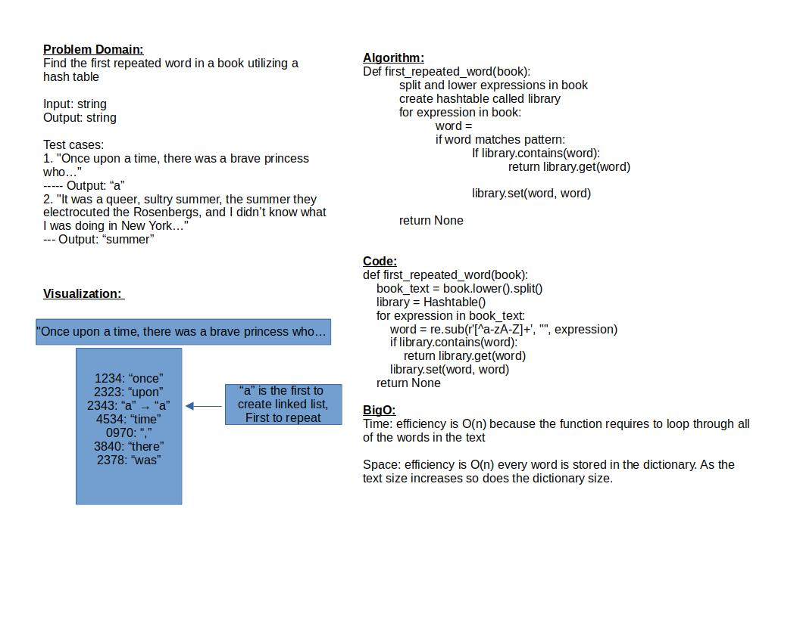

# Challenge Summary

Find the first repeated word in a book utilizing a hash table

## Whiteboard Process

## Approach & Efficiency

Time efficiency: efficiency is O(n) because the function requires to loop through all of the words in the text

Space efficiency: efficiency is O(n) every word is stored in the dictionary. As the text size increases so does the dictionary size.

## Solution

test is run by: `pytest-watch -c -- -k test_hashtable_repeated_word.py`

[Link to code](../../code_challenges/hashtable_repeated_word.py)

[Link to tests](../../tests/code_challenges/test_hashtable_repeated_word.py)
