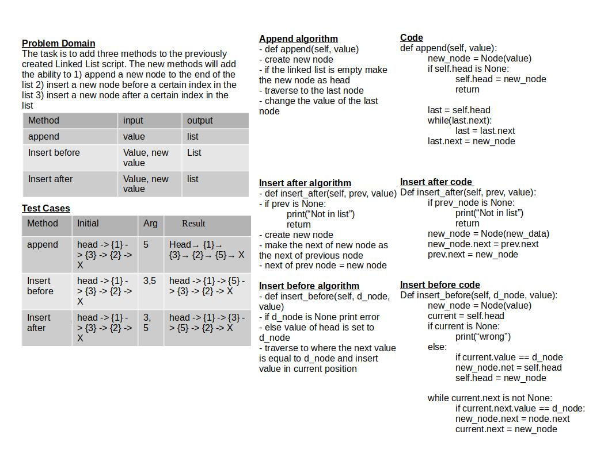

# Challenge Summary

This challenge is to add three methods to the previously created Linked List script. The new methods will add the ability to 1) append a new node to the end of the list 2) insert a new node before a certain index in the list 3) insert a new node after a certain index in the list

## Whiteboard Process

## Approach & Efficiency

Time efficiency: O(n)
Space efficiency: O(1)

## Solution

script is run by running: `python data_structures/linked_list.py`
from the python directory

test is run by: `pytest-watch -c -- -k test_linked_list_insertions.py`
