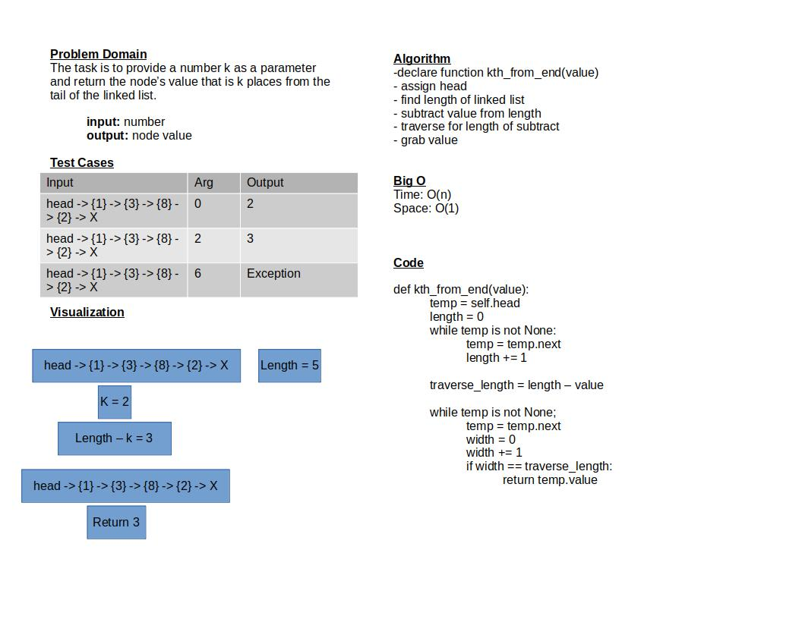

# Challenge Summary

The task is to provide a number k as a parameter and return the node’s value that is k places from the tail of the linked list

## Whiteboard Process

## Approach & Efficiency

Time efficiency: O(n)
Space efficiency: O(1)

## Solution

script is run by running: `python data_structures/linked_list.py`
from the python directory

test is run by: `pytest-watch -c -- -k test_linked_list_kth.py`
