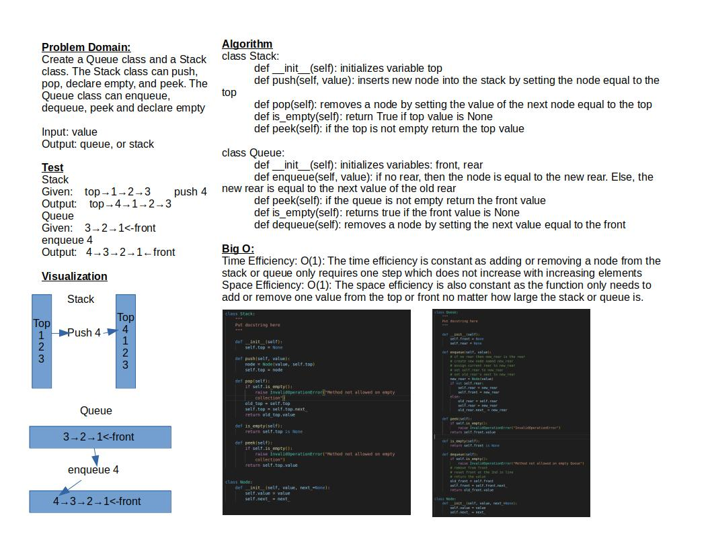

# Stacks and Queues

This challenge implements a linked list as a data storage mechanism in order to implement a Stack and a Queue

## Challenge

The goal of this challenge is to create a Stack and Queue module.

The stack module is capable of pushing a value into the stack, popping a value from the top of the stack, peeking to see if there is a value at the top of the stack, and an indicator if the stack is empty.

The Queue module is capable of putting a value in the queue (enqueue), removing a value from the front of the queue (dequeue), peeking to see if there is a value in the front of the queue, and an indicator to see if the queue is empty.

## Approach & Efficiency

The approach is to make the new node the top or front for the stack and queue respectively when using the push or enqueue methods. When removing a value from the stack or the queue, we set the value of the top or the front equal to the value of the next.

Time Efficiency: O(1): The time efficiency is constant as adding or removing a node from the stack or queue only requires one step which does not increase with increasing elements
Space Efficiency: O(1): The space efficiency is also constant as the function only needs to add or remove one value from the top or front no matter how large the stack or queue is.

## API

stack.py

`def __init__(self)`: This method initializes the variables for the class Stack

`def push(self, value)`: This method inserts a new node into the stack by setting the node equal to the top

`def pop(self)`: This method removes a node from the stack by setting the value of the next node equal to the top

`def is_empty(self)`: This method returns True if the value of the top is None

`def peek(self)`: peek grabs the value of the top

queue.py

`def __init__(self)`: initializes the variables for the class Queue

`def enqueue(self, value)`: adds a node to the queue by setting the node value equal to the rear

`def peek(self)`: checks the value of the front node

`def is_empty(self)`: returns true if the front value is None

`def dequeue(self)`: removes a node by setting the next value equal to the front

