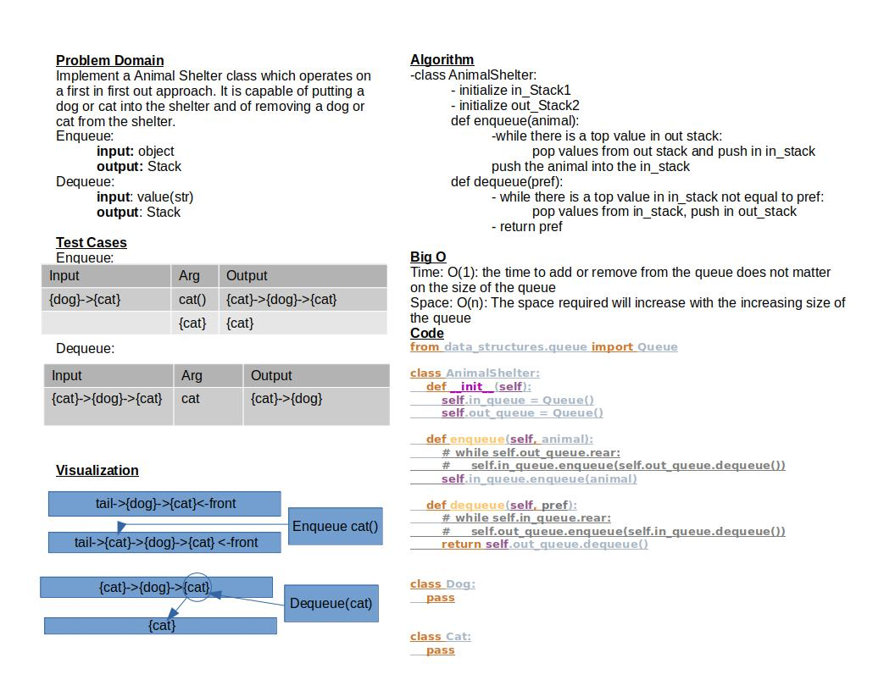

# Challenge Summary

Implement an Animal Shelter class which operates on a first in first out approach.
It is capable of putting a dog or cat into the shelter and of removing a dog or cat from the shelter.

## Whiteboard Process

## Approach & Efficiency

The approach I took was similar to the queue challenge.
Time: O(1): the time to add or remove from the queue does not matter on the size of the queue
Space: O(n): The space required will increase with the increasing size of the queue

## Solution

To run the test for stack_queue_pseudo.py run: `pytest-watch -c -- -k test_stack_queue_animal_shelter.py`

The code does not yet work
