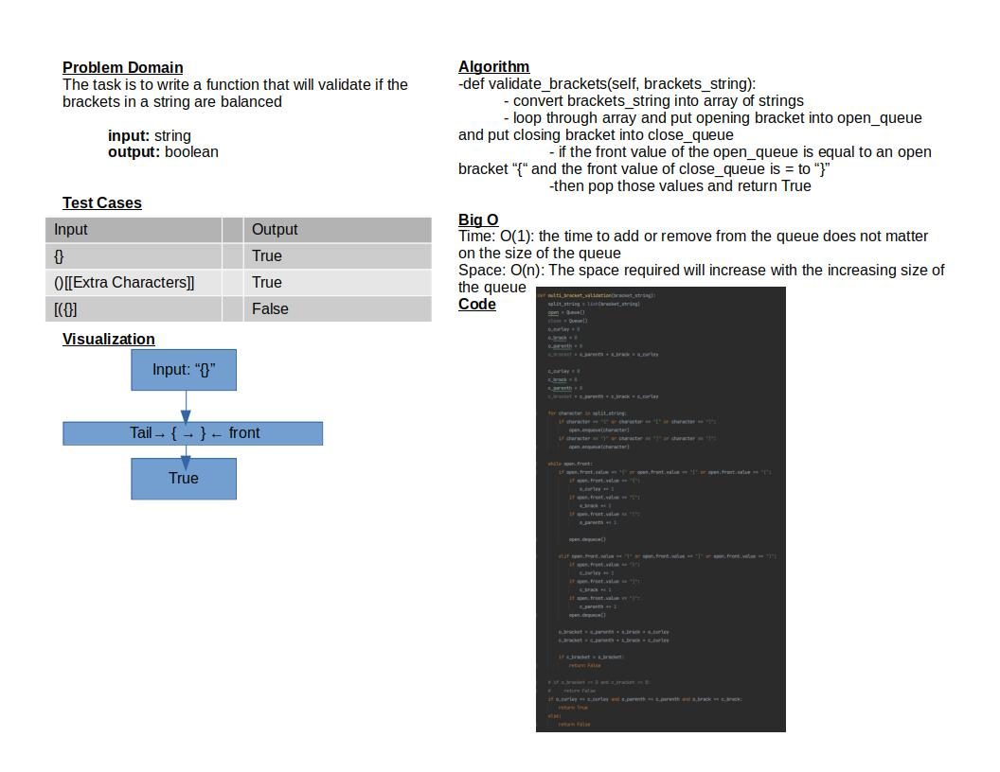

# Challenge Summary

The task is to write a function that will validate
if the brackets in a string are balanced

## Whiteboard Process

## Approach & Efficiency

The approach I took was to convert the input into an array of strings and loop through it
to add each item into a queue.I would then check the value of the front of the queue, keep a tally,
then dequeue it from the queue if the tallies matched then I returned true if not then i returned false.

Time: O(1): the time to add or remove from the queue does not matter on the size of the queue
Space: O(n): The space required will increase with the increasing size of the queue

## Solution

To run the test for stack_queue_pseudo.py run: `pytest-watch -c -- -k test_stack_queue_brackets.py`

9/9 tests pass

[Code](python/code_challenges/stack_queue_brackets.py)
