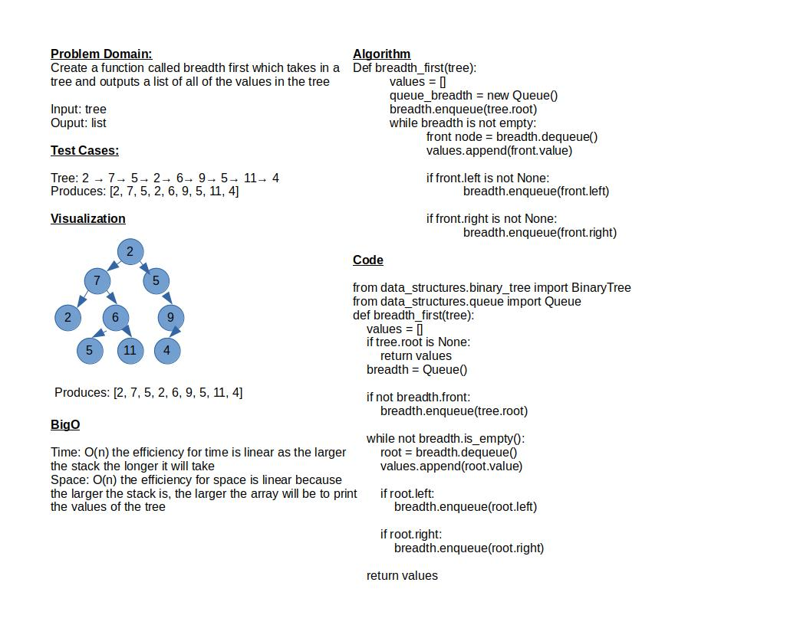

# Challenge Summary

Create a function called breadth first which takes in a tree and outputs a list of all of the values in the tree

## Whiteboard Process

## Approach & Efficiency

Time: O(n) the efficiency for time is linear as the larger the stack the longer it will take
Space: O(n) the efficiency for space is linear because the larger the stack is, the larger the array will be to print the values of the tree

## Solution

Run the tests by running: `pytest-watch -c -- -k test_tree_breadth_first.py`

3 / 6 tests pass
