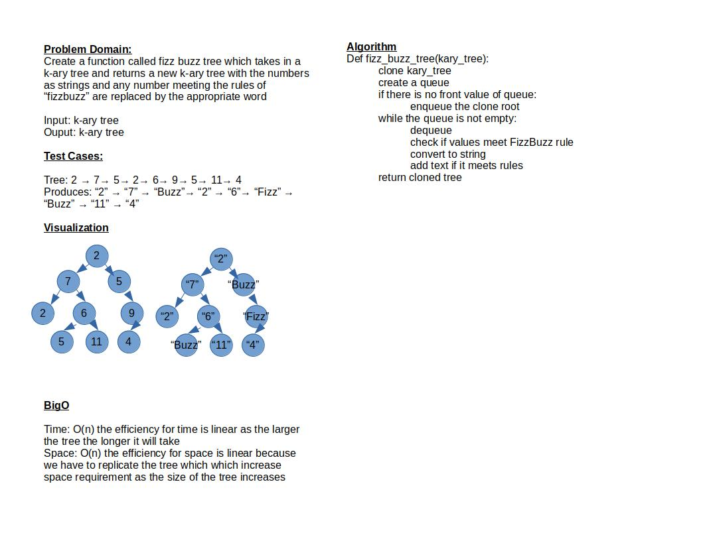

# Challenge Summary

Create a function called fizz buzz tree which takes in a k-ary tree and returns a new k-ary tree with the numbers as strings and any number meeting the rules of “fizzbuzz” are replaced by the appropriate word

## Whiteboard Process

## Approach & Efficiency

Time: O(n) the efficiency for time is linear as the larger the tree the longer it will take
Space: O(n) the efficiency for space is linear because we have to replicate the tree which which increase space requirement as the size of the tree increases

## Solution

Pending
