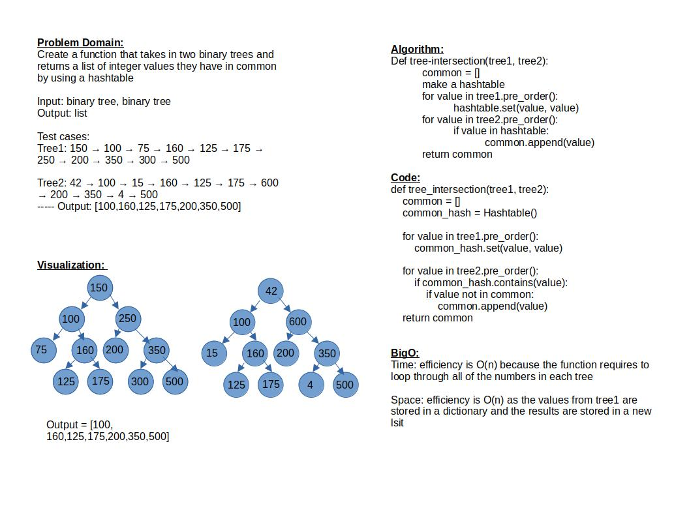

# Challenge Summary

Create a function that takes in two binary trees and returns a list of integer values they have in common by using a hashtable

## Whiteboard Process

## Approach & Efficiency

Time: efficiency is O(n) because the function requires to loop through all of the numbers in each tree

Space: efficiency is O(n) as the values from tree1 are stored in a dictionary and the results are stored in a new list

## Solution

test is run by: `pytest-watch -c -- -k test_tree_intersection.py`

[Link to code](../../code_challenges/tree_intersection.py)

[Link to tests](../../tests/code_challenges/test_tree_intersection.py)
