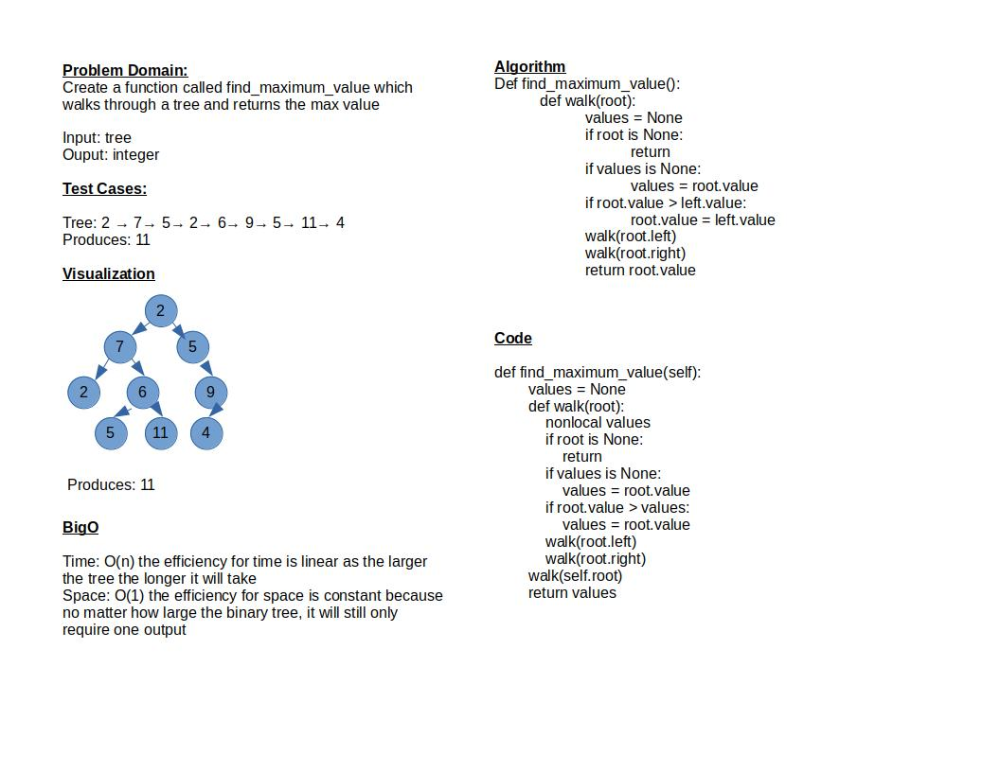

# Challenge Summary

Create a function called find_maximum_value which walks through a tree and returns the max value

## Whiteboard Process

## Approach & Efficiency

Since a lab requirement was to make a function which has no arguments I made it with an internal walk method similar to the other methods in BinaryTree.

Time: O(n) the efficiency for time is linear as the larger the tree the longer it will take
Space: O(1) the efficiency for space is constant because no matter how large the binary tree, it will still only require one output

## Solution

To run test: `pytest-watch -c -- -k test_tree_max.py`
